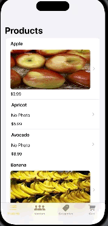
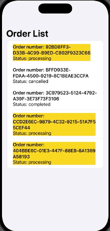

# FruitShop 

FruitShop, a dual-app e-commerce platform designed for online fruit shopping experience. This project is comprised of two interconnected applications:

1. **Client App:** This user-friendly application allows clients to browse and purchase a variety of fruit. Every order placed through this app is instantly transmitted to the dealer for processing.

2. **Client App:** Specifically designed for dealers, this app provides a comprehensive view of all incoming orders. Dealers can manage and fulfill orders efficiently.

# Packages 

This project utilizes GRDB as the database solution to manage data persistence. It specifically stores and retrieves the products that clients add to their shopping carts.

# Server

This project incorporates the Swagger API for defining and documenting the API endpoints. The API supports various operations including GET, POST, DELETE, and PUT methods for managing vendors, product photos, products, and categories. It also defines several order states including paymentPending, processing, completed, and cancelled, facilitating the tracking and management of order progress.

## Client App Interface Overview:

The header labeled "Products" is displayed. Below this header, a list is presented where each product is named and priced. For instance, "Apple" is shown alongside a photo and a price tag. Some products, such as "Apricot" and "Avocado," are indicated without photos beacuse they do not exists in the API, with the placeholder text "No Photo" and their respective prices.

### Vendors Tab
Labeled "Vendors" is available. This section can be accessed where various fruit vendors are selectable by users.

### Vendor's Page
A dedicated page is revealed upon the selection of a vendor. On this page, all products offered by the vendor are showcased.

### Categories of Fruit
An option to navigate through different fruit categories is also provided.

### Categories Page

 A dedicated page for each category is accessible, where the available products are listed.

### Cart
 Within the cart, orders can be reviewed, the amount due is visible, the quantity of items can be adjusted, and the purchase can be finalized.

 ## Dealer App Interface Overview:

 

### Main Page
A single main page is comprised within the app where a comprehensive view of every order, along with its current status — processing, completed, or cancelled — is provided for the dealer's attention.

### Order Management

When swiped to the left, an order presents the dealer with options; the order can be cancelled or marked as completed. It is noted that every order being processed is highlighted in yellow, and this highlight is removed once the order's status is updated.
